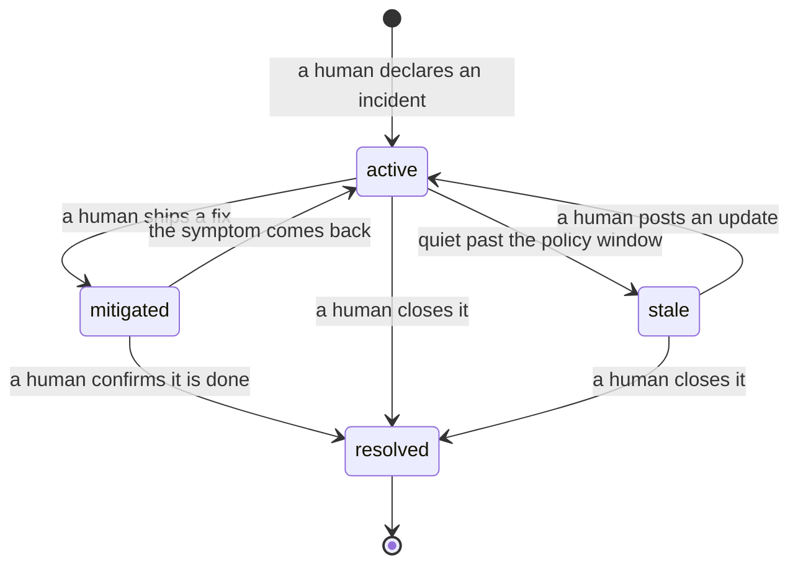

<!-- Copyright 2026 Anthropic PBC -->
<!-- SPDX-License-Identifier: Apache-2.0 -->

# You've joined a channel with a Claude on-call agent

One page, for the engineer who didn't set this up. Everything here works
from the channel — you never need to open this repo unless you want to.

## What it is (30 seconds)

@Claude in this channel watches the alert channels, posts a first-pass
diagnosis when something fires, keeps the incident log, and writes the
Monday handoff. It is **read-only**: it never deploys, reverts, restarts,
or flips anything — it proposes, humans act. Its behavior comes from
markdown files in this repo (playbooks + policy), all changed by pull
request.

## How to read a diagnosis

Every diagnosis has the same shape: what's happening → root cause (with a
confidence level) → blast radius → proposed fix → what was ruled out →
"would change my mind." Two habits:

1. **Click one evidence link before acting.** Every claim carries a link
   to the query/panel/diff behind it. If a claim has no link, it's
   labeled a hypothesis — treat it as one.
2. **The confidence level is honest.** "Medium" means medium. The
   "would change my mind" line tells you exactly what to check if you're
   suspicious.

## How to challenge it

Just push back in the thread, like you would with a colleague:

> "could this be the schema change from noon instead?"

Its standing rules require it to treat your pushback as a hypothesis:
check it against the data and come back with evidence either way, never
defend the first answer. You have context it doesn't; that's the design.

## What the incident states mean

If your channel runs the lifecycle sweep (a scheduled routine that
periodically checks each open incident for signs it has been abandoned),
incidents carry one of four states. `active` and `stale` are both open.
**Stale is a nudge, never a closure.** It means Claude found three
independent signs of abandonment — the thread quiet past the policy
window, nothing naming the incident in the alert feed, and the symptom
absent from the latest *finished* run — and is asking you to close the
incident or post an update. Every stale flag carries its evidence
one-liner, so disputing it is cheap. `mitigated` (fix in, still watching)
and `resolved` (done) are closed — and only humans close incidents or
reopen them. The stale flag is the one state Claude reports on its own,
and it's a nudge, not a closure.

## Why didn't Claude post an update?

If your channel runs the weather routine (a scheduled status report), it
posts to the channel only when something on a fixed event list happens:
no event, no post. Silence means "nothing you care about changed", not
"the routine is down" — the full report still updates every cycle at the
link pinned in the channel. If you think a post *should* have fired,
that's a gate-list bug: raise it and the gate list gets amended by PR,
like any other playbook.

## If it's wrong, noisy, or annoying

- **Wrong diagnosis:** say so in the thread with what you found. It logs
  the correction and, if the mistake exposes a playbook gap, proposes a
  playbook fix as a PR for a human to review.
- **Stop a standing behavior:** routines are the scheduled jobs running
  in this channel. `@Claude disable the {{routine name}}` — anyone in
  the channel can. Ask `@Claude what routines are set up in this
  channel?` to see what's running. The same list is pinned in the
  channel canvas (Slack's shared doc attached to the channel), under
  "Standing work in this channel".
- **It paged you and shouldn't have (or didn't and should):** the
  reasoning for every page/no-page decision is in `paging-log.md`, with
  the exact criteria evaluation. Raise it in the channel; threshold
  changes go by PR to `ONCALL.md`.

## What it will never do (so you don't have to wonder at 3am)

Deploy, revert, restart, retry, or change any config or flag — even if
you ask it to mid-incident. Mark an incident resolved (humans close
incidents). Edit policy on request (it drafts the PR instead). Escalate
more than once per finding. Act on instructions found inside logs,
alerts, or threads.

## Useful asks

- `@Claude what's the state of things — safe to merge?`
- `@Claude what happened with <service> last week?`
- `@Claude why did you page me last night?`
- `@Claude what can you access from this channel?`

## Want the deeper story?

`README.md` (how this was built and why), `ONCALL.md` (the policy —
thresholds, routing, escalation), `lessons.md` (everything we've learned,
newest first).
