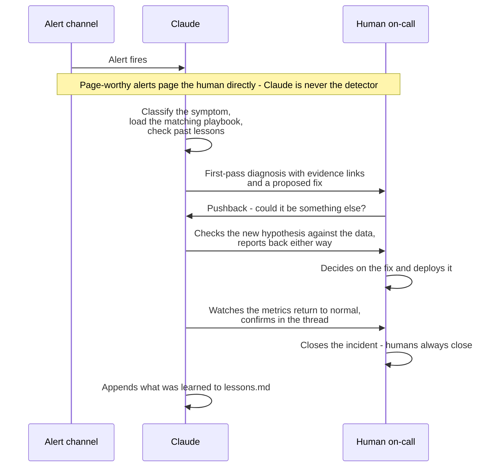
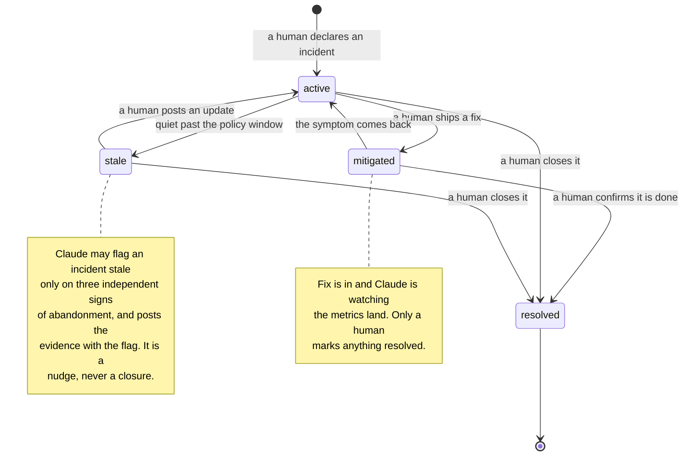
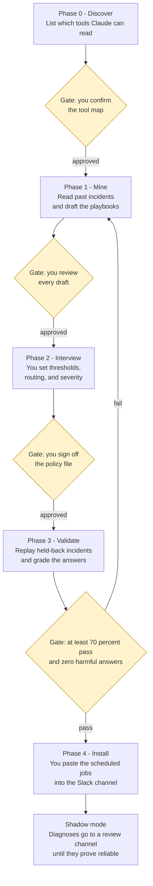

# oncall-lab

A deliberately fragile checkout service. Its only job is to break in
predictable ways so a Claude-assisted on-call has something real to
diagnose.

Built to exercise [anthropics/oncall-kit](https://github.com/anthropics/oncall-kit).

## The loop

1. `./scripts/break.sh <class>` flips a chaos flag and pushes
2. GitHub Actions fails at a known stage
3. The workflow posts a formatted alert to `#ci-alerts` in Slack
4. Claude Tag picks it up, reads this repo and the run logs, posts a
   diagnosis with a link behind each claim, and proposes a fix
5. A human merges. Claude watches the next run go green.

## Failure classes

| Class | Command | Fails at | Signature |
|---|---|---|---|
| Flaky checkout test | `./scripts/break.sh flaky_checkout_test` | test | `payment sandbox did not settle within 50ms` - passes on retry |
| Broken dependency | `./scripts/break.sh broken_dependency` | install | `404 Not Found - GET .../left-pad-but-typoed` |
| Type error | `./scripts/break.sh type_error` | lint | `parse error: type annotations are not valid in a .js file` |
| Slow build | `./scripts/break.sh slow_build` | build | job cancelled after the 2 minute step timeout |

Put it all back: `./scripts/break.sh fix`.

Only one flag at a time. Two flags means two signatures in one run, and
the triage playbooks get muddier for no benefit.

## History

`history/` holds this team's past incidents: pager exports, channel
threads, and postmortems. The on-call kit mines these to draft its
triage playbooks. It is fictional, generated by
`scripts/seed-history.js`, and dated to look like the last 90 days.

## Why this README continues below

Everything after this line is the on-call kit's own README, kept verbatim.
The `oncall-setup` skill reads `README.md` by name to learn its target
state, so it has to live here rather than in a file of its own.

---

# On-Call Kit



Put Claude in your team's incident channel. When an alert fires, it
investigates and posts a first-pass diagnosis with a link behind every
claim. A human decides what to do. Claude then watches the fix land and
writes down what was learned, so the next incident starts smarter.

> **Reference implementation. Not maintained and not accepting contributions.**

This is the kit behind [the blog post](https://claude.com/blog/ai-ci-cd-on-call)
on building a CI on-call with Claude: the playbooks, templates, and a
guided setup that drafts those playbooks from your team's own incident
history. (Throughout: a **skill** is a markdown instruction file that
tells Claude how to do one job — triage an alert, write a handoff. You
review and change skills like code.)

Two properties worth knowing up front:

- **It works with whatever tools you already use.** No skill names a
  specific vendor. Skills refer to *capabilities* — the metrics source,
  the log store, the pager, the code host — and one generated file,
  `STACK.md`, maps each capability to the tool your channel actually has
  connected. Swap Datadog for Grafana, or PagerDuty for Opsgenie, and no
  skill changes.
- **You don't write the playbooks from scratch.** Setup reads your
  team's past incidents — alert threads, pager history, postmortems —
  and drafts the playbooks from what your team actually did. You review
  and correct the drafts.

## Try it in 10 minutes

Zero connections, zero admin. Clone this repo anywhere, open Claude Code
in it, and paste the one instruction from `test-fixtures/RUNBOOK.md`.
You'll watch the whole setup run against a fictional team's 48-incident
history: mining, playbook drafting, the sign-off gates, a graded
validation against an answer key. Nothing real is touched, so there is
nothing to clean up if you stop here.

The fixture doubles as the kit's regression test: change a skill, re-run
it, diff against the key.

## What you get

One Slack channel where:

- an alert landing in a watched channel (or a human declaring an
  incident) starts an investigation automatically
- Claude posts a grounded first-pass diagnosis — every claim linked to
  the log line or dashboard panel behind it — and **proposes** a fix
- a human decides, a human (or gated automation) deploys, and Claude
  watches the metrics land back at baseline
- anyone can ask for status on demand ("safe to merge?") and get an
  answer grounded in the open incident records
- every incident appends to `lessons.md`, so the next investigation
  starts smarter
- Monday morning, the handoff writes itself

The division of labor is fixed and non-negotiable (see `CLAUDE.md`):
Claude gathers evidence, proposes, verifies, and communicates. **Humans
decide what to mitigate and when.**

## Words this kit uses

Eight terms, defined once:

- **Capability binding** — the line in `STACK.md` mapping an abstract
  capability ("metrics") to your real tool ("Grafana").
- **Routine** — a standing task Claude runs in the Slack channel on a
  schedule or trigger ("watch #ci-alerts", "post the handoff Monday
  9am"). You create one by pasting or saying the request in the channel;
  anyone in the channel can list or disable them.
- **Canvas** — Slack's built-in document attached to a channel. The kit
  uses one to list the channel's routines and, optionally, to hold the
  weather report.
- **Shadow period** — the trial phase: Claude posts diagnoses to a
  review channel while humans handle incidents as before. It goes live
  only after its answers prove reliable.
- **Holdout** — a past incident deliberately kept out of playbook
  drafting, so it can serve as an unseen test in the Validate phase.
- **Provenance tag** — the annotation on every mined playbook claim
  saying how many incidents support it, e.g. `(seen 2×, unverified)`.
- **Page-tier vs. morning log** — the two urgency tiers: a *page* wakes
  a human now; a *morning log* line waits for the daily summary.
  `ONCALL.md` decides which is which.
- **MCP** — the connector protocol Claude uses to reach tools like your
  metrics source or pager. Your Claude org Owner attaches these
  connections (see `TAG-SETUP.md`).

## How it works: the incident loop



Stage by stage:

| Lifecycle stage | Who/what |
|---|---|
| Detection | Your existing alerting stays primary: alerts fire into channels, and page-worthy ones page humans directly. Claude is never the detector. It watches the alert channels, triages what fires, and correlates across them — five alerts are often one incident. For a new service with no alerts yet, it drafts conservative starter rules for a human to install before launch |
| Diagnosis | The `triage` skill: classify the symptom, load the matching reference file, check `lessons.md` for known causes, post a grounded diagnosis with evidence links |
| Mitigation | **Human decides.** Claude proposes — including, where your team uses feature flags, a ready-to-execute canary ramp plan: the flag, the percentage steps, the hold time at each step, and the single metric that aborts the ramp. The human cross-examines, chooses, and deploys (or approves a gated action). The kit never touches a flag; it writes the plan a human runs |
| Verification | "Watch it land": Claude polls the affected metrics until baseline, posts confirmation |
| Communication | On-demand: anyone asks in the channel and gets a fresh-reader answer from the open incident records and ONCALL.md's health signals. Incident records are whatever your team already uses — threads, channels, pager incidents, tickets — bound in `STACK.md`, always opened by a human. Standing status is opt-in via the `weather` skill (see below) |
| Status (optional) | The `weather` routine: report written every cycle to one linkable page, channel posted only on event gates, always diffed against the last post the channel actually received — never against a report nobody saw |
| Learning | Every resolved incident appends to `lessons.md`; recurring patterns get promoted into reference files by PR |
| Handoff | The `handoff` skill, Monday morning: what happened / what it means / what you should do, triage-ready |

Open incidents move through four states. Every arrow into or out of the
closed states is a human action; the one arrow Claude drives is the
stale flag — an evidence-backed nudge, never a closure:



## Setting up: five gated phases



Every yellow diamond is a hard stop: Claude delivers the phase's output
and waits for your sign-off. Nothing activates before Phase 4, and
nothing pages anyone until after shadow mode.

| Phase | What happens | Output | Gate |
|---|---|---|---|
| 0. Discover | Enumerate the channel's connections; probe read access on each | `STACK.md` | human confirms the capability map |
| 1. Mine | Read the last 30–90 days of resolved incidents (pager history, alert-channel threads, postmortems); cluster into failure classes; draft one reference file per class; seed `lessons.md`; propose a routing tree from CODEOWNERS + who actually responded | draft `skills/triage/references/*.md`, seeded `lessons.md`, routing tree in `ONCALL.md` | human reviews every draft; low-confidence entries stay marked |
| 2. Interview | Ask the human only what can't be mined: paging thresholds (with suggested values from alert history), deploy windows, severity norms, escalation owners | completed `ONCALL.md` | human signs off the policy |
| 3. Validate | Replay 5–10 held-out past incidents (reserved during Mine and never used for drafting, so the test is blind) against the drafted playbooks; grade each ✅/⚠️/❌/🚫 | grading table | ≥70% ✅+⚠️ and zero 🚫, or return to Mine |
| 4. Install | Emit the paste-ready routine messages with real channel and tool names filled in | routines live in the channel | human pastes each routine |

The rhythm is identical every phase: a four-line briefing (what happens,
how long, what changes, what the gate will ask), the work, a hard stop
for your sign-off. Nothing rolls into the next phase on momentum. A few
phase-specific notes:

- **Mine** opens with a scope-consent message — exactly which sources it
  will read, exclusions honored — and ends with your failure classes,
  playbook drafts tagged with provenance, a seeded `lessons.md`, an
  alert-coverage report, and any routing conflicts or bus-factor
  findings. All proposals, nothing installed.
- **Interview** is ~15 minutes of questions only a human can answer:
  thresholds (with mined suggestions), severity, routing, deploy
  windows, escalation timeout and fallback, alert-rule install mode.
  Output: a completed `ONCALL.md` worth PR-reviewing.
- **Validate** replays holdouts blind and grades them in a fresh
  context. The grading table is also what you show teammates who ask
  whether this is worth adopting.
- **Install** verifies the channel can actually read this repo. Then
  Claude hands you each routine as a short ready-to-paste message; you
  paste them into the Slack channel one at a time, smallest scope first.
  The alert-watch routine runs in shadow until the evidence clears the
  bar — two weeks triggers a mandatory review, not automatic graduation —
  and paging gets its own go/no-go decision after that.

One rule runs through everything: **when a diagnosis is wrong, fix the
playbook that produced it, not just the answer.** One-off misses get
corrected in the thread; a repeated miss means a playbook file needs
amending. (The idea comes from the
[migration kit](https://github.com/anthropics/code-migration-kit-with-claude-code).)

**Life after setup** is three loops at three speeds: per incident
(triage → verify → log), weekly (handoff with on-call health, drift
check, promotion PRs), and quarterly (replay re-validation, especially
after infrastructure changes). Your time goes to reading the handoff and
merging small PRs; the judgment calls stay yours.

## Installing for real

You don't need to memorize this list. The first time Claude opens a
session in a fresh clone (no `STACK.md` yet), it introduces itself, lays
out the five setup phases, and offers to start. Nothing runs, probes, or
connects without your explicit yes — there are no install-time triggers,
by design.

1. **Check your stack.** Before asking anyone for anything, verify a
   read-only connection exists for each capability you'll bind: metrics
   (Grafana/Datadog/…), logs, code host, pager, and your alert channels.
   Missing one is fine: the kit works around each gap, and the Gaps
   section of `STACK.md` records exactly what you lose. Just know what's
   missing before the admin conversation, not after.
2. **Copy the kit in.** Copy these into the repository your on-call
   channel will read (usually your team/infra repo): `CLAUDE.md`'s rules
   (merge the whole rules block into your repo's `CLAUDE.md`, verbatim),
   `skills/` (oncall-setup, triage, handoff, and optionally weather),
   `templates/`, `eval/replay.md`, `ONBOARD.md`, and this `README.md`
   (the oncall-setup skill reads it by name). Optional:
   `test-fixtures/` (the demo + regression test) and `hooks/` (plugin
   installs only). Setup will *generate* the rest at the root:
   `STACK.md`, `ONCALL.md`, `lessons.md`, `paging-log.md`,
   `alert-coverage.md`, `eval/replay-results.md`.
3. **Connect the channel.** Invite `@Claude` to your incident channel
   (`/invite @Claude`) and have an Owner attach the read-only
   connections from step 1. This uses **Claude Tag** — @Claude as a
   member of your Slack channels, available on Claude Team and
   Enterprise plans. New to it? **`TAG-SETUP.md`** covers what you can
   do yourself vs. what needs your Claude org Owner, including a
   paste-ready request message with a suggested pilot spend limit.
4. **Run setup.** In the channel, say `@Claude run the oncall-setup
   skill` (or type the same in a Claude Code session opened in the
   repo). Each phase stops and waits for your sign-off before the next
   begins; nothing activates until the final phase.
5. **Start in shadow.** For the first stretch, Claude posts its
   diagnoses to a separate review channel while humans handle incidents
   exactly as before — you grade it without depending on it. Graduate it
   when it clears the accuracy bar in `eval/replay.md`, not after a
   fixed number of weeks.

## What's in the kit

```
your-repo/
├── CLAUDE.md            # repo-wide context (yours; import the kit's rules)
├── ONCALL.md            # standing policy: paging criteria, routing, severity
├── STACK.md             # capability → connector map (generated by setup)
├── lessons.md           # living incident log (Claude appends, humans prune)
└── skills/
    ├── triage/          # SKILL.md router + references/<failure-class>.md
    ├── handoff/         # the weekly handoff
    └── weather/         # optional: the event-gated standing status report
```

Everything in the kit is one of four kinds of content. Every other doc
defers to this table:

| Thing | Lives where | Who changes it | How |
|---|---|---|---|
| **Skills** (how to investigate, report, hand off) | this repo, `skills/` | humans (Claude proposes) | pull request |
| **Policy** (thresholds, routing, severity — `ONCALL.md`) | this repo, root | humans only | pull request |
| **Routines** (scheduled instructions telling Claude when and where to run standing work) | the Slack channel | anyone in the channel | say it in the channel |
| **Memory** (`lessons.md`, `paging-log.md`; channel memory) | repo root (files) / Anthropic-side (channel memory) | Claude appends files freely; humans prune | direct append; files always outrank channel memory |

Rule of thumb: if it decides *when/where*, it's a routine; if it decides
*how* and you'd want review before it changes, it's a file. Paging
thresholds are policy, so they live in git.

## Is it working?

Two levels, both in `eval/replay.md`:

- **Per-incident:** every diagnosis must carry evidence links; the human
  cross-examines; and within the hour, the metrics either return to
  baseline or they don't.
- **Per-playbook:** replay held-out historical incidents and grade.
  Track agreement rate, time-to-first-response, and escalation rate over
  time. Re-run the replay after any substantial playbook change.

## What this kit deliberately does not do

- **Standing status is opt-in — and never a fast-polling agent.** The
  default is status on demand: ask in the channel, get an answer
  grounded in the open incident records. If your team wants a standing
  "weather report" — one page compiling open incidents, build health,
  merge-queue stats, and deploy lag — install the optional `weather`
  skill and routine. It is built to be cheap and quiet. Each cycle
  starts with a fast check of whether a report is even due — frequent
  while a page-severity incident is open, hourly when quiet — and exits
  if it isn't time yet. The full report is written every cycle to one
  linkable page. The channel gets a post **only when a defined event
  fires**: a new incident, trunk blocked or cleared, a health tier
  crossed, an incident's status/severity/ETA changed, or a staleness
  check-in. Silence is the common case — a handful of posts a day in bad
  weather, near zero when it's sunny. An agent that re-investigates and
  posts on every cycle is explicitly out of scope. Full design:
  `skills/weather/SKILL.md`.

  

- **Not an incident-management framework.** Severity levels, incident
  command, and stakeholder communications remain your team's existing
  process — the kit plugs into it (ONCALL.md links to yours) and never
  runs an incident or talks to stakeholders beyond the channel.
- **No auto-mitigation, period.** The agent is read-only toward every
  system it monitors — its only outputs are messages, log entries, the
  opt-in weather report page, proposed PRs, and pages. There is no
  allowlist to widen. If your team wants automated mitigation, build it
  as its own system, with its own review and its own named owner —
  outside this kit. Proposing is fully in scope: a diagnosis may end
  with a paste-ready flag-ramp plan or an opened revert PR. Executing
  either is a human act, and verification (watch the metric land back at
  baseline at each ramp step) is Claude's job again once the human acts.
- **No vendor coupling.** If a skill in your fork names a specific tool,
  that's a bug; put the binding in `STACK.md`.
- **No unreviewed memory.** Channel memory — the facts Claude retains
  between conversations in a channel — is convenient, but nobody reviews
  it. Anything load-bearing (criteria, routing, lessons) lives in git,
  where it gets reviewed.

## Adapting beyond CI

The kit is written for a CI/build-infrastructure on-call because that's
the worked example, but nothing binds it there. The failure classes in
`skills/triage/references/` are yours to replace: a payments on-call
would have `card-declines.md` and `webhook-lag.md` instead of
`test-failures.md` and `merge-queue.md`. The setup skill's mining phase
discovers *your* classes from *your* history; the CI names in the
templates are placeholders, not defaults. The resolution patterns
transfer too: a payments team's card-declines reference would carry a
"proposing a ramp-down" block — the pattern is worked in
`skills/triage/references/deploy-rollout.md`. For a complete fictional
non-CI run — with the filled policy file and about 2 hours of total
human time — see `examples/run1-webshop/`.

## Project status

> **Status:** Reference code. Fork it and it becomes your team's code;
> your fork is expected to diverge as your playbooks grow. The one file
> worth diffing against upstream occasionally is `CLAUDE.md` (the safety
> rules).

## Support

This project is provided AS IS. Issues and pull requests are not
monitored, so we cannot guarantee fixes for bugs or implementation of
feature requests.
